<!-- TOC -->
  * [Blocks](#blocks)
    * [form.config.json](#formconfigjson)
    * [Field types](#field-types)
      * [Text](#text)
      * [Select](#select)
      * [Textarea](#textarea)
      * [Btn](#btn)
      * [File](#file)
      * [Editor](#editor)
      * [Switch](#switch)
      * [Checkbox](#checkbox)
      * [Radio](#radio)
      * [Icon](#icon)
      * [Repeatable](#repeatable)
    * [module.html.twig](#modulehtmltwig)
    * [screenshot.png](#screenshotpng)
* [Styling](#styling)
  * [Typography](#typography)
    * [Css variables](#css-variables)
    * [Css classes](#css-classes)
  * [Colors](#colors)
    * [Css variables](#css-variables-1)
    * [Css classes](#css-classes-1)
<!-- TOC -->

## Blocks

----

A block element is composed of 3 files:
- `form.config.json` - The configuration file used to generate the form in the editor
- `module.html.twig` - The template file used to render the block on the website
- `screenshot.png` - The screenshot used to display the block preview in the editor block list

> You can see examples of a block in the `example` folder
---

### form.config.json

The `form.config.json` file is used to generate the form in the editor. It is composed of an array of objects, each object representing a type of input in the form.

For every field, the `name` key will allow you to access the data in the twig component.

i.e. :
```json
[
  {
    "label": "Titre",
    "name": "title",
    "type": "text",
    "required": true,
    "design": {
      "col": "6"
    }
  },
  {
    "label": "Type",
    "name": "type",
    "type": "select",
    "required": true,
    "default": "h1",
    "options": [
      { "value": "h1", "label": "H1" },
      { "value": "h2", "label": "H2" },
      { "value": "h3", "label": "H3" },
      { "value": "h4", "label": "H4" },
      { "value": "h4", "label": "H4" },
      { "value": "h5", "label": "H5" },
      { "value": "h6", "label": "H6" }
    ],
    "design": {
      "col": "6"
    }
  }
]
```

Render:<br />
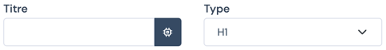

Every field object has the following base schema, every key in red is required, the rest is optional.
<pre>
{
    <b style="color: indianred">label</b>: string, 
    <b style="color: indianred">name</b>: string,
    <b style="color: indianred">type</b>: 'text' | 'textarea' | 'select' | 'btn' | 'file' | 'editor' | 'switch' | 'checkbox' | 'radio' | 'repeatable' | 'icon',
    <b style="color: indianred">required</b>: boolean,
    design: {
        col: string (i.e "6")
    }
}
</pre>

The design key is used to handle the form layout in the editor. The `col` key is used to define the width of the field in the editor. 
The value is a string representing the number of columns the field should take in the editor. 
The value should be between 1 and 12, as the layout is based on a 12 width grid.<br />
This key is available on every field type.

### Field types

#### Text

```json
{
    "label": "Titre",
    "name": "title",
    "type": "text",
    "required": true,
    "design": {
      "col": "6"
    }
}
```
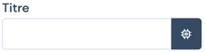

#### Select

In this example, the select is used to define the heading level of the title. The `options` key is used to define the available options in the select.

```json
{
    "label": "Type",
    "name": "type",
    "type": "select",
    "required": true,
    "default": "h1",
    "options": [
      { "value": "h1", "label": "H1" },
      { "value": "h2", "label": "H2" },
      { "value": "h3", "label": "H3" },
      { "value": "h4", "label": "H4" },
      { "value": "h4", "label": "H4" },
      { "value": "h5", "label": "H5" },
      { "value": "h6", "label": "H6" }
    ],
    "design": {
      "col": "6"
    }
  }
```
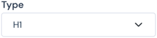

#### Textarea

```json
{
    "label": "Description",
    "name": "description",
    "type": "textarea",
    "required": true,
    "design": {
      "col": "12"
    }
}
```
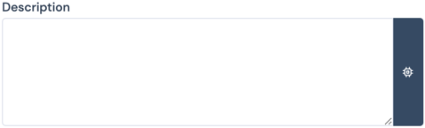

#### Btn

This field type will automatically generate a form with the following options:
 - Label
 - Link
 - A checkbox to define if the link should open in a new tab or not

```json
{
    "label": "Button",
    "name": "btn",
    "type": "btn",
    "required": true,
    "design": {
      "col": "12"
    }
}
```
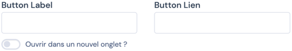

#### File

```json
{
    "label": "File",
    "name": "file",
    "type": "file",
    "required": true,
    "design": {
      "col": "12"
    }
}
```
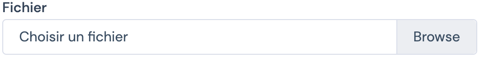

#### Editor

This field will generate a WYSIWYG editor in the form.

```json
{
    "label": "Content",
    "name": "content",
    "type": "editor",
    "required": true,
    "design": {
      "col": "12"
    }
}
```
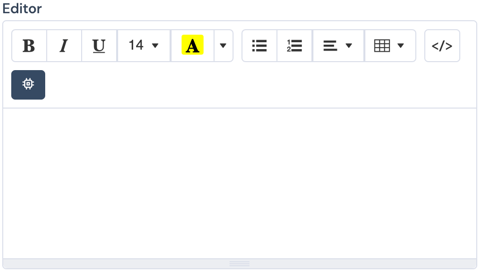

#### Switch

This field will generate a switch in the form.

```json
{
    "label": "Switch",
    "name": "switch",
    "type": "switch",
    "required": true,
    "design": {
      "col": "12"
    }
}
```


#### Checkbox

This field will generate a checkbox in the form.<br />
The `options` key is used to define the available options for the checkboxes.

```json
{
    "label": "Checkbox",
    "name": "checkbox",
    "type": "checkbox",
    "required": true,
    "options": [
        { "value": "1", "label": "Value 1" },
        { "value": "2", "label": "Value 2" },
        { "value": "3", "label": "Value 3" },
        { "value": "4", "label": "Value 4" }
    ],
    "design": {
      "col": "12"
    }
}
```

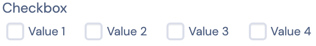

#### Radio

This field will generate a radio input in the form.<br />
The `options` key is used to define the available options for the radio.

```json
{
    "label": "Radio",
    "name": "radio",
    "type": "radio",
    "required": true,
    "options": [
        { "value": "1", "label": "Value 1" },
        { "value": "2", "label": "Value 2" },
        { "value": "3", "label": "Value 3" },
        { "value": "4", "label": "Value 4" }
    ],
    "design": {
      "col": "12"
    }
}
```
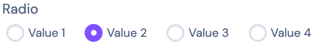


#### Icon

This field will generate a select input with all the available icons in the form.<br />

```json
{
    "label": "Icon",
    "name": "icon",
    "type": "icon",
    "required": true,
    "design": {
      "col": "12"
    }
}
```
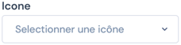<br />
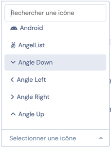

#### Repeatable

This field will generate a repeatable field in the form.<br />
Repeatables are used to create a list of fields that can be repeated as many times as needed.<br />
Repeatables are not meant to be nested, and therefor can't be used inside another repeatable.<br />

```json
{
        "label": "Repeatable",
        "name": "repeatable",
        "type": "repeatable",
        "required": true,
        "schema": [
            {
                "label": "Titre",
                "name": "title",
                "type": "text",
                "required": true
            },
            {
                "label": "Editor",
                "name": "editor",
                "type": "editor",
                "required": true,
                "design": {
                    "col": "12"
                }
            },
            {
                "label": "Switch",
                "name": "switch",
                "type": "switch",
                "required": true,
                "design": {
                    "col": "12"
                }
            }
        ]
    }
```
<br />
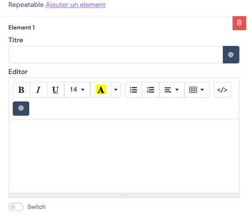

---


### module.html.twig

The `module.html.twig` file is used to render the module on the front of your site.<br />

The templating is handled by the [Twig](https://twig.symfony.com/) templating engine.<br />

If your module requires it, you can embed the needed styles and scripts in the `module.html.twig` file,
in their respective `<style>` and `<script>` tags.<br />

The `module.html.twig` file has access to the following variables:
- `content`: The content of the module, as defined in the `form.config.json`. For example, if you have a `title` field in your form, you can access it in the `module.html.twig` file by using `{{ content.title }}`. 
<br />
- `id`: The id of the module. This is used to identify the module in the DOM, and to make sure that the module is unique on the page. This id is automatically generated by the module builder, and is unique for each module on the page.

Example twig:
```html
<style></style>
<section data-module="{{ id }}">
    <div class="block-wrapper">
        <div class="card-1-header">
            <div class="card-1-header-title-container">
                
                    <p class="card-1-header-tagline">{{ content.tagline }}</p>
                
                <{{ content.type }} class="card-1-header-title">{{ content.title }}</{{ content.type }}>
            </div>
            <div class="card-1-header-description">{{ content.paragraph|raw }}</div>
        </div>
        <div class="card-1-elements-container">
            
                
                    <div class="card-1-element-wrapper">
                        
                        <p class="card-1-element-legend">{{ card.subtitle }}</p>
                        <p class="card-1-element-title">{{ card.title }}</p>
                    </div>
                
            
        </div>
    </div>
</section>
<script></script>
```

The `data-module` attribute on your first section must be used to scope your styles and scripts to the module.<br />

Example:
```html
<style>
    [data-module="{{ id }}"] {
        /* Your css for your block root element */
    }
    [data-module="{{ id }}"] .block-header {
        /* Your css for your div with `block-header` class */
    }
</style>
<section data-module="{{ id }}">
    {# Your module html #}
    <div class="block-header">
        {# Your module html #}
    </div>
    {# Your module html #}
</section>
<script></script>
```

In most cases, you need to use a wrapper as first and unique child of the section with the `data-module` attribute. Add the `block-wrapper` class on it to apply common style. See example just below:<br />

```css
.block-wrapper {
    padding-inline: var(--block-padding-inline);
    padding-block: var(--block-padding-block);
    max-width: var(--block-width, var(--wrapper-max-width));
    margin-inline: auto;
}
```
As you can see, we use css variables to apply common style. Please don't modify any css variable, it can break the design of the platform.<br /> 
The only one you can modify in your css is `--block-width` to change the max-width of your block **only if needed**. In most cases, you won't need to set this variable. <br />


---

### screenshot.png

<br />
Pretty self explanatory, this file is used to display a preview of your module in the editor, in the block list.<br />
For best results, it is advised to use a 16/9 aspect ratio image.<br />

---

# Styling

To style your modules, you have access to some css variables and some are exposed with css classes.<br />

> You can see the common css in the `css/module.scss` file.

---

## Typography

For typography styling, you have access to some css variables and classes.<br />
For most text element, **please use the css class** `text` to harmonize the style of all text in the platform.<br />

> **Information**: By default, 1rem is set to 10px to simplify rem/em calculation. On the body element, the font-size is set to 1.6rem (16px) and all text tag (p,li,h1,h2,h3,...) font-size are set to `inherit`.

### Css variables

| Variable name      | Description                    | Default value                       |
|--------------------|--------------------------------|-------------------------------------|
| **Font family**    |                                |                                     |
| --ff-primary       | Title font family              | 'Roboto Condensed', sans-serif      |
| --ff-secondary     | Paragraph font family          | 'Roboto', sans-serif                |
|                    |                                |                                     |
| **Font size**      |                                |                                     |
| --fs-lg            | Large font size                | clamp(3.2rem, 5vw + 1rem, 5rem)     |
| --fs-md            | Medium font size               | clamp(1.6rem, 1vw + 1rem, 2rem)     |
| --fs-sm            | Small font size                | clamp(1.2rem, 0.5vw + 1rem, 1.4rem) |
|                    |                                |                                     |
| **Font weight**    |                                |                                     |
| --fw-body          | Body font weight               | 400                                 |
| --fw-heading-lv1   | Heading level 1 font weight    | 700                                 |
| --fw-heading-lv2   | Heading level 2 font weight    | 700                                 |
|                    |                                |                                     |
| **Line height**    |                                |                                     |
| --lh-body          | Body line height               | 1.4em                               |
| --lh-heading-lv1   | Heading level 1 line height    | 1.2em                               |
| --lh-heading-lv2   | Heading level 2 line height    | var(--lh-heading-lv1)               |
|                    |                                |                                     |
| **Letter spacing** |                                |                                     |
| --ls-body          | Body letter spacing            | 0                                   |
| --ls-heading-lv1   | Heading level 1 letter spacing | -1px                                |
| --ls-heading-lv2   | Heading level 2 letter spacing | -0.5px                              |

### Css classes

| Class name      | Description                              | Default value              |
|-----------------|------------------------------------------|----------------------------|
| **Text class**  | **Use this class for design typography** |                            |
| .heading-lv1    | Used for main titles                     | See ./css/_typography.scss |
| .heading-lv2    | Used for sub titles                      | See ./css/_typography.scss |
| .text-body      | Used for paragraph                       | See ./css/_typography.scss |
| .text-caption   | Used for caption text                    | See ./css/_typography.scss |
|                 |                                          |                            |
| **Font family** | **Utils class for isolated text**        |                            |
| .ff-primary     | Apply primary font family                | var(--ff-primary)          |
| .ff-secondary   | Apply secondary font family              | var(--ff-secondary)        |
|                 |                                          |                            |
| **Font weight** | **Utils class for isolated text**        |                            |
| .fw-300         | Thin font weight                         | 300                        |
| .fw-400         | Normal font weight                       | 400                        |
| .fw-500         | Medium font weight                       | 500                        |
| .fw-600         | Semi-bold font weight                    | 600                        |
| .fw-700         | Bold font weight                         | 700                        |
| .fw-900         | Black font weight                        | 900                        |

---

## Colors

### Css variables

| Variable name      | Description                                                         | Default value      |
|--------------------|---------------------------------------------------------------------|--------------------|
| --clr-main         | Main/background color                                               | #ffffff            |
| --clr-primary      | Primary color for CTA or highlight something                        | #1F4E84            |
| --clr-secondary    | Secondary color (light version of primary color)                    | #EFF5FB            |
| --clr-text-darker  | Text color used by default                                          | #060F19            |
| --clr-text-dark    | Light version of text darker color                                  | #0F243E            |
| --clr-text-midtone | Midtone version of text darker color, used like 50% opacity on text | #8C96A1            |
| --clr-text-lighter | Text color used on dark background                                  | #FFFFFF            |
| --clr-text-light   | Little darker than --clr-text-lighter                               | #EEF4FB            |
| --clr-list-marker  | List marker color                                                   | var(--clr-primary) |

### Css classes

All the css variables are exposed with css classes except for list marker color.<br />

| Class name        | Render                          |
|-------------------|---------------------------------|
| .clr-main         | color: var(--clr-main);         |
| .clr-primary      | color: var(--clr-primary);      |
| .clr-secondary    | color: var(--clr-secondary);    |
| .clr-text-darker  | color: var(--clr-text-darker);  |
| .clr-text-dark    | color: var(--clr-text-dark);    |
| .clr-text-midtone | color: var(--clr-text-midtone); |
| .clr-text-light   | color: var(--clr-text-light);   |
| .clr-text-lighter | color: var(--clr-text-lighter); |

Those classes exist for background too.

| Class name           | Render                                     |
|----------------------|--------------------------------------------|
| .bg-clr-main         | background-color: var(--clr-main);         |
| .bg-clr-primary      | background-color: var(--clr-primary);      |
| .bg-clr-secondary    | background-color: var(--clr-secondary);    |
| .bg-clr-text-darker  | background-color: var(--clr-text-darker);  |
| .bg-clr-text-dark    | background-color: var(--clr-text-dark);    |
| .bg-clr-text-midtone | background-color: var(--clr-text-midtone); |
| .bg-clr-text-light   | background-color: var(--clr-text-light);   |
| .bg-clr-text-lighter | background-color: var(--clr-text-lighter); |
